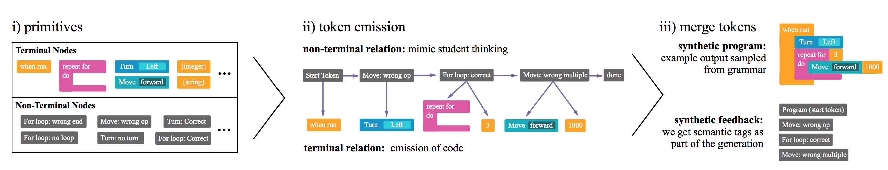
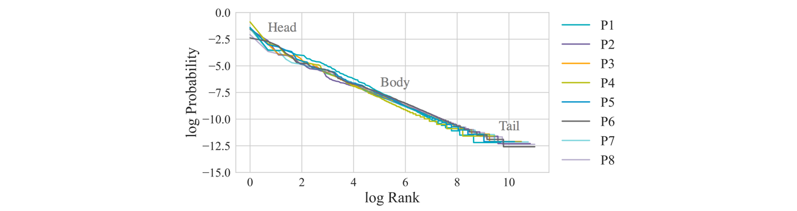
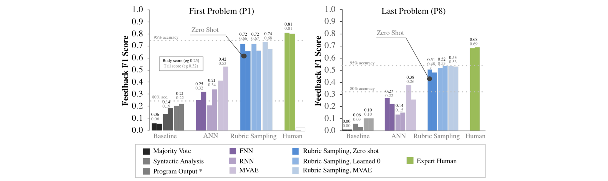
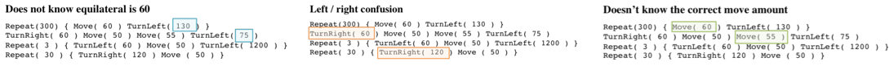

# rubric-sampling

PyTorch implementation of the paper [Zero Shot Learning for Code Education: Rubric Sampling with Deep Learning Inference](https://arxiv.org/abs/1809.01357) by Mike Wu, Milan Mosse, Noah Goodman, and Chris Piech (AAAI 2019).

## About
Massive open online courses (MOOCs) log thousands of hours of data about how students solve coding challenges. Being so rich in data, these platforms have garnered the interest of the machine learning community, where the challenge is to autonomously provide feedback to help students learn. **But annotating programs is expensive, especially since the space of possible programs is Zipfean.** This repository implements *rubric sampling*, a zero shot solution to scalable feedback prediction. Rubric sampling asks the human-in-the-loop to describe a generative process of student thinking in the form of a probabilistic context-free grammar (PCFG), which allows for infinite data generation and takes exponentially less time than labeling even a tiny dataset. Rubric sampling can be combined with either supervised networks or modern deep generative models (MVAE). We apply these methods to a Code.org curriculum, containing 8 exercises with 1,598,375 student solutions. 



### Zero Shot Feedback  Challenge

For small classrooms and massive online platforms alike, it is infeasible to acquire the supervision required for contemporary nonlinear methods. This work is largely intended to set the baseline for  what can be done with little to no labels.



The image above plots the log rank vs the log probability of every program in the curricula. The linearity indicates how closely programs follow a Zipf distribution.

### Code.org Datasets
The dataset contains a curriculum of 8 exercises involving drawing a shape in 2-dimensional space given a discrete set of actions in a block-based environment. The student's goal is to utilize concepts of geometry and looping to complete each exercise, which increases in difficulty. The dataset is composed of unlabeled programs submitted by former users of Code.org. We painstakingly labeled a small set (~300 unique programs) for problem 1 and 8,  mostly meant for baselines and computing performance. 

The feedback labels represent mistakes that students made or concepts that they successfully understood. For example, failing to loop the correct number of times, or incorrectly identifying an angle.


The image above shows problems 1 to 8. Students have to drag blocks to get the artist to draw each shape.

__**IMPORTANT: we are still working with Code.org to publicly release the curriculum. As of now, this repo does not contain student data or annotated labels (only contains synthetically generated data). We will release the real data ASAP.**__

### Expert Rubrics
Rubrics are designed in our meta-language, which can be found in `/rubrics`. Problem 1 contains two rubrics, one made by a University professor and one made by an undergraduate teaching assistant. Problems 2 through 8 contain only one rubric made by the TA.

## Usage
This repo is written as a python module, so when running files you must be in the root directory is use the following syntax:

```
python -m module.submodule.file <args> <kwargs>
```

### Requirements
We use PyTorch 0.4.1 and any compatible versions of NumPy, Pandas, Scikit-Learn. We also require NLTK and tqdm.  

We enumerate the different steps to training and evaluating models:

#### Preprocessing Data

Given the raw data, we need to run the preprocessing script for every problem (1 through 8) and each type of data (unlabeled, annotated). 

```
python -m rubric_sampling.experiments.preprocess <data_type> <problem_id>
```

Optionally, if you have synthetic data (either from a PCFG or MVAE), we can use the same script:

```
python -m rubric_sampling.experiments.preprocess synthetic <problem_id> --sample-pickle <path_to_sample_pickle_file>
```

Example of a program from the dataset:


#### Sampling from PCFG

Rubric sampling involves generating a lot of synthetic data so that we can fully train more expressive models. To do that, use the following:

```
python -m rubric_sampling.experiments.sample_pcfg <problem_id> <path_to_save_data>  (--student-pcfg) (--random-theta)

```

By default, we generate 1000000 data points and keep only unique examples. 

The flag `--student-pcfg`, if supplied, will use the TA's PCFG. The flag `--random-theta`, if supplied, will randomly initialize the parameters of the PCFG (rather than hand-picked ones).

#### Training Models

For baselines, we can train a supervised RNN on the annotated data alone: 

```
python -m rubric_sampling.experiments.train_rnn annotated <problem_id> <path_to_save_model>
```

Or a "supervised" MVAE:

```
python -m rubric_sampling.experiments.train_mvae annotated <problem_id> <path_to_save_model>
```

These won't do that well as the number of training points is less than 300. Instead, we mostly want to train on top of synthetic data.

```
python -m rubric_sampling.experiments.train_rnn synthetic <problem_id> <path_to_save_model>
```

```
python -m rubric_sampling.experiments.train_mvae synthetic <problem_id> <path_to_save_model>
```

#### Evaluating Models

The paper reports F1 scores split by feedback type (loops or geometry). We provide the scripts to do so:

```
python -m rubric_sampling.experiments.eval_rnn <path_to_tar_file>
```

Or for the MVAE,

```
python -m rubric_sampling.experiments.eval_mvae <path_to_tar_file>
```

In practice, we find that using the PCFG to augment the dataset helps performance enormously.



#### Sampling from MVAE

After training a MVAE, we can sample from it ancestrally. 

```
python -m rubric_sampling.experiments.sample_mvae ./tmp/mvae/model_best.pth.tar <path_to_save_data> --num-samples <integer> (--add-unlabeled-data)
```

The flag `--add-unlabeled-data` allows us to use programs that haven't been labeled to better learn the marginal distribution over student programs (a tough challenge with little data). 

This will generate a similar pickle file to sampling from the PCFG. However, we do not only keep unique samples; as we are interested in density estimation, the MVAE is trained using the *log-Zipf trick*, meaning will produce samples with log-frequency.


As the MVAE is a latent variable model, we can plot a projection of the latent variable in two dimensions. We see that the programs are nicely clustered semantically.

#### Highlighting Code

```
python -m rubric_sampling.experiments.highlight_code.highlight <problem_id> <path_to_save>
```

Example of highlighting: 




**Note**: some lesser functionalities from the paper have been omitted for simplicity in this repo (i.e. some baselines, evolutionary search, etc.). But, they can be added upon request. 

## Citation

If you find this useful for your research, please cite:

```
@article{wu2018zero,
  title={Zero Shot Learning for Code Education: Rubric Sampling with Deep Learning Inference},
  author={Wu, Mike and Mosse, Milan and Goodman, Noah and Piech, Chris},
  journal={arXiv preprint arXiv:1809.01357},
  year={2018}
}
```
